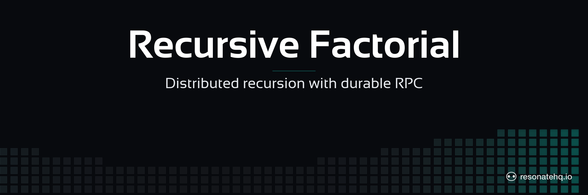

<p align="center">
  <picture>
    <source media="(prefers-color-scheme: dark)" srcset="./assets/banner-dark.png">
    <source media="(prefers-color-scheme: light)" srcset="./assets/banner-light.png">
    
  </picture>
</p>

<p align="center">
  <a href="https://resonatehq.github.io/examples-ci/">
    
  </a>
</p>

# Recursive Factorial | Resonate Go SDK

Distributed recursion via durable RPC: `factorial(n)` recursively dispatches `factorial(n-1)` through the server, so each step is a promise that any registered worker can pick up.

> Heads up — `resonate-sdk-go` is pre-release. The SDK has no semver tag yet, so this example pins to a specific commit. Expect API changes until `v0.1.0`.

## What this demonstrates

- A **recursive workflow** dispatched via `ctx.RPC` rather than a local call. Each recursive step creates a durable promise.
- A **worker / client split**: the workflow definition lives in a shared package; workers join a named group and register the function; the client targets the worker group when invoking.
- **Fan-out across workers**: run multiple worker processes and the recursion's intermediate steps will spread across them.
- **Idempotent invocations**: running the client twice with the same `-n` returns the cached result of the first run instead of recomputing.

## The code

```go
// factorial/factorial.go
const Name = "Factorial"
const WorkerGroup = "factorial-workers"

type Args struct {
    N int `json:"n"`
}

func Workflow(ctx *resonate.Context, args Args) (int, error) {
    if args.N <= 1 {
        return 1, nil
    }
    f, err := ctx.RPC(Name, Args{N: args.N - 1})
    if err != nil { return 0, err }
    var sub int
    if err := f.Await(&sub); err != nil { return 0, err }
    return args.N * sub, nil
}
```

```go
// cmd/client/main.go (excerpt)
id := fmt.Sprintf("factorial-%d", *n) // stable id — second run returns cached result
h, _ := r.RPC(ctx, id, factorial.Name, factorial.Args{N: *n},
    resonate.RPCOptions{Target: factorial.WorkerGroup})

var result int
_ = h.Result(ctx, &result)
fmt.Printf("factorial(%d) = %d\n", *n, result)
```

## Prerequisites

- Go 1.22+
- The `resonate` server CLI. Install with Homebrew on macOS or Linux:
  ```
  brew install resonatehq/tap/resonate
  ```
  Other install paths: <https://docs.resonatehq.io/get-started/install>.

## Setup

```sh
git clone https://github.com/resonatehq-examples/example-recursive-factorial-go.git
cd example-recursive-factorial-go
go mod download
```

## Run it

In one terminal, start the dev server:

```sh
resonate dev
```

In one or more additional terminals, start workers:

```sh
go run ./cmd/worker
```

Then, in another terminal, kick off a workflow:

```sh
go run ./cmd/client -n 6
```

Run the client twice with the same `-n` to see Resonate return the cached result instantly the second time.

## What to look for

Client output:

```
factorial(6) = 720
```

On the dashboard at <http://localhost:8001> you'll see one root promise (`factorial-6`) plus a chain of child promises for each recursive call (`factorial-6.1`, `factorial-6.1.1`, …). Re-running the client with `-n 6` resolves immediately — the root promise is already settled.

## The code (detail)

Three files:

1. **[factorial/factorial.go](./factorial/factorial.go)** — the workflow. `Workflow(ctx, args)` recursively calls itself via `ctx.RPC(Name, ...)`, awaits the sub-result, multiplies, returns. Stops when `args.N <= 1`. Also exports `Name` and `WorkerGroup` constants shared by the two binaries.
2. **[cmd/worker/main.go](./cmd/worker/main.go)** — constructs an HTTP network in the `factorial-workers` group, registers `factorial.Workflow` under `factorial.Name`, then blocks on SIGINT/SIGTERM. The Resonate SDK's background goroutines pick up dispatched tasks automatically.
3. **[cmd/client/main.go](./cmd/client/main.go)** — uses `r.RPC(ctx, id, factorial.Name, args, resonate.RPCOptions{Target: factorial.WorkerGroup})` to invoke the workflow remotely, then `h.Result(ctx, &result)` to block for the typed result. The client does NOT register the workflow — it only needs to know the function name and which group to target.

Why the worker group: without it, the client process also subscribes to the default dispatch pool and the server may try to dispatch tasks to it, producing "function not found" noise on retry. Using a named worker group keeps clients out of the pool.

## File structure

```
example-recursive-factorial-go/
├── factorial/
│   └── factorial.go    workflow definition (package factorial)
├── cmd/
│   ├── worker/main.go  registers + serves
│   └── client/main.go  invokes via r.RPC, awaits result
├── go.mod              module declaration + SDK pin
├── go.sum              checksums
├── assets/             README banner images
├── LICENSE             Apache-2.0
└── README.md
```

## Next steps

- [Durable promises](https://docs.resonatehq.io/concepts/durable-promises) — how recursive `ctx.RPC` calls become a tree of cached promises.
- [Get started](https://docs.resonatehq.io/get-started) — install paths + first-program walkthrough.
- [`example-fan-out-fan-in-go`](https://github.com/resonatehq-examples/example-fan-out-fan-in-go) — flat parallelism instead of recursive fan-out.

## Community

- Discord: <https://resonatehq.io/discord>
- X: <https://x.com/resonatehqio>
- LinkedIn: <https://linkedin.com/company/resonatehq>
- YouTube: <https://youtube.com/@resonatehq>
- Journal: <https://journal.resonatehq.io>

## License

[Apache-2.0](./LICENSE)
